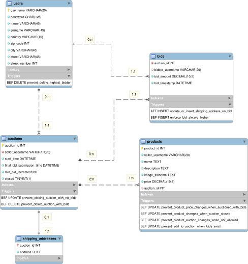
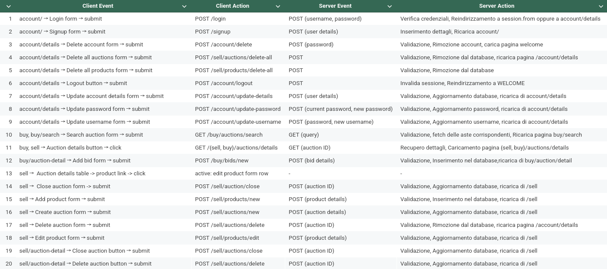
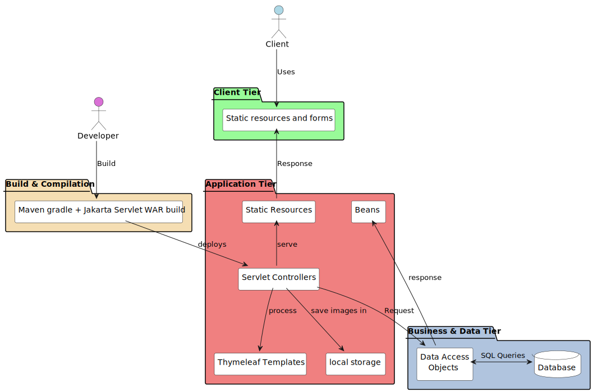
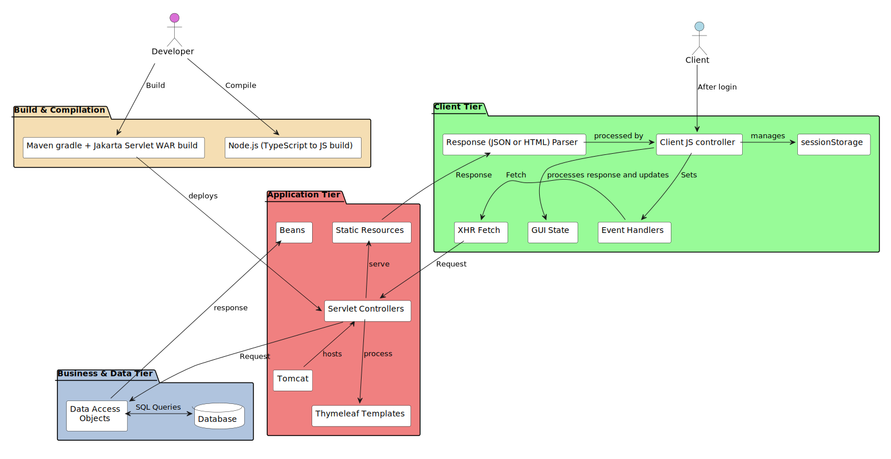
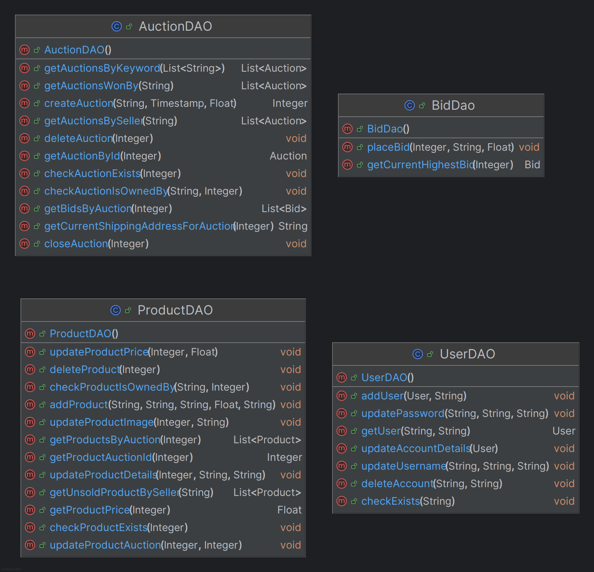
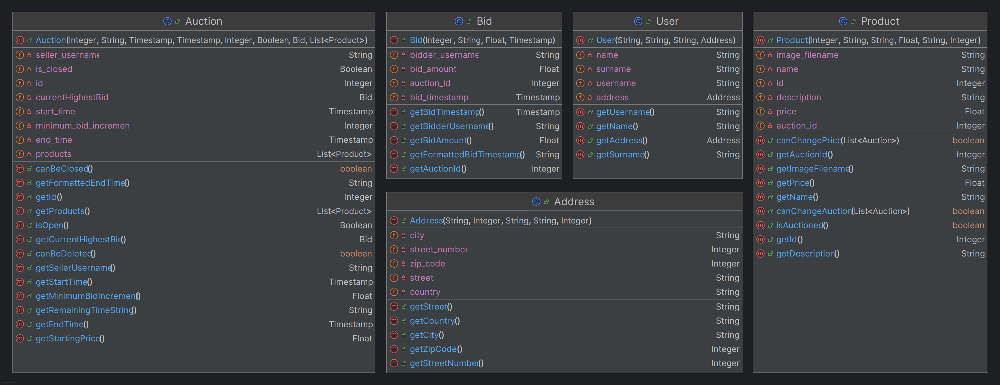
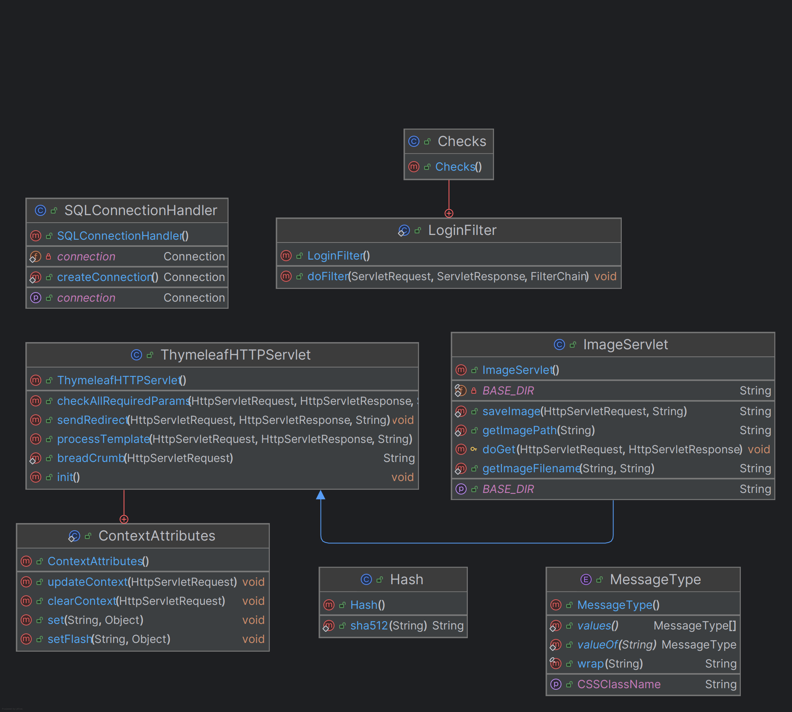

# Tiw - 2025

_Project documentation_

**Author**: Francesco Genovese

**Date**: 05/2025

**Professor**: Piero Fraternali


---

## Database requirements


--
## Entity-Relationship Diagram

--

## Implementation

--

## SQL code

### DDL

```sql
CREATE SCHEMA `your-auction`;
USE `your-auction`;

CREATE TABLE `users` (
    `username` VARCHAR(20) PRIMARY KEY,
    `password` CHAR(128) NOT NULL,
    `name` VARCHAR(45) NOT NULL,
    `surname` VARCHAR(45) NOT NULL,
    `country` VARCHAR(45) NOT NULL,
    `zip_code` INTEGER NOT NULL,
    `city` VARCHAR(45) NOT NULL,
    `street` VARCHAR(45) NOT NULL,
    `street_number` INTEGER NOT NULL
);

CREATE TABLE `auctions` (
    `auction_id` INTEGER PRIMARY KEY AUTO_INCREMENT,
    `seller_username` VARCHAR(20) NOT NULL,
    `start_time` DATETIME NOT NULL DEFAULT CURRENT_TIMESTAMP,
    `final_bid_submission_time` DATETIME NOT NULL,
    `min_bid_increment` INTEGER NOT NULL DEFAULT 1,
    `closed` BOOLEAN NOT NULL DEFAULT 0,
    FOREIGN KEY (`seller_username`) REFERENCES `users` (`username`) ON UPDATE CASCADE ON DELETE CASCADE
);

CREATE TABLE `products` (
    `product_id` INTEGER PRIMARY KEY AUTO_INCREMENT,
    `seller_username` VARCHAR(20) NOT NULL,
    `name` TEXT NOT NULL,
    `description` TEXT,
    `image_filename` TEXT NOT NULL,
    `price` DECIMAL(10, 2) NOT NULL,
    `auction_id` INTEGER DEFAULT NULL,
    FOREIGN KEY (`auction_id`) REFERENCES `auctions` (`auction_id`) ON UPDATE CASCADE ON DELETE
    SET
        NULL
);

CREATE TABLE `bids` (
    `auction_id` INTEGER NOT NULL,
    `bidder_username` VARCHAR(20),
    `bid_amount` DECIMAL(10, 2) NOT NULL,
    `bid_timestamp` DATETIME NOT NULL DEFAULT CURRENT_TIMESTAMP,
    INDEX (`auction_id` ASC, `bid_timestamp` DESC),
    FOREIGN KEY (`auction_id`) REFERENCES `auctions` (`auction_id`) ON UPDATE CASCADE ON DELETE CASCADE,
    FOREIGN KEY (`bidder_username`) REFERENCES `users` (`username`) ON UPDATE CASCADE ON DELETE
    SET
        NULL,
        CONSTRAINT `unique_bid_amount` UNIQUE (`auction_id`, `bid_amount`),
        CONSTRAINT `unique_bid_timestamp` UNIQUE (`auction_id`, `bidder_username`, `bid_timestamp`)
);

CREATE TABLE shipping_addresses (
    auction_id INTEGER NOT NULL,
    address TEXT NOT NULL,
    PRIMARY KEY (auction_id),
    FOREIGN KEY (auction_id) REFERENCES auctions (auction_id) ON UPDATE CASCADE ON DELETE CASCADE
);
```

--

### Triggers

```sql
USE `your-auction`

DROP TRIGGER IF EXISTS enforce_bid_always_higher;
DROP TRIGGER IF EXISTS update_or_insert_shipping_address_on_bid;
DROP TRIGGER IF EXISTS prevent_product_changes_when_auction_closed;
DROP TRIGGER IF EXISTS prevent_product_price_changes_when_auctioned_with_bids;
DROP TRIGGER IF EXISTS prevent_product_auction_changes_when_not_allowed;
DROP TRIGGER IF EXISTS prevent_delete_highest_bidder;
DROP TRIGGER IF EXISTS prevent_delete_auction_with_bids;
DROP TRIGGER IF EXISTS prevent_closing_auction_with_no_bids;

DELIMITER `~;`

CREATE TRIGGER enforce_bid_always_higher
BEFORE INSERT ON bids
FOR EACH ROW
BEGIN
    DECLARE max_bid DECIMAL(10, 2);
    DECLARE min_increment INTEGER;
    DECLARE total_price DECIMAL(10, 2);

    -- Get the maximum bid amount for the auction
    SELECT COALESCE(MAX(bid_amount), 0) INTO max_bid
    FROM bids
    WHERE auction_id = NEW.auction_id;

    -- Get the minimum bid increment for the auction
    SELECT min_bid_increment INTO min_increment
    FROM auctions
    WHERE auction_id = NEW.auction_id;

    -- Get the total price of products in the auction
    SELECT COALESCE(SUM(price), 0) INTO total_price
    FROM products
    WHERE auction_id = NEW.auction_id;

    -- Check if the new bid amount is valid
    IF NEW.bid_amount < GREATEST(max_bid + min_increment, total_price) THEN
        SIGNAL SQLSTATE '45000'
        SET MESSAGE_TEXT = 'bid amount must be greater than highest bid plus minimum increment or total price of products in the auction';
    END IF;
END ~;


CREATE TRIGGER update_or_insert_shipping_address_on_bid
AFTER INSERT ON bids
FOR EACH ROW
BEGIN
    IF EXISTS (SELECT 1 FROM shipping_addresses WHERE auction_id = NEW.auction_id) THEN
        UPDATE shipping_addresses
        SET address = (SELECT CONCAT_WS(', ', u.street, u.street_number, u.city, u.zip_code, u.country)
                       FROM users u
                       WHERE u.username = NEW.bidder_username)
        WHERE auction_id = NEW.auction_id;
    ELSE
        INSERT INTO shipping_addresses (auction_id, address)
        VALUES (NEW.auction_id,
                (SELECT CONCAT_WS(', ', u.street, u.street_number, u.city, u.zip_code, u.country)
                 FROM users u
                 WHERE u.username = NEW.bidder_username));
    END IF;
END ~;

CREATE TRIGGER prevent_product_changes_when_auction_closed BEFORE
UPDATE
    ON products FOR EACH ROW BEGIN IF EXISTS (
        SELECT
            auction_id, closed
        FROM
            auctions a
        WHERE
            a.auction_id = OLD.auction_id
            AND a.closed = 1
    ) THEN SIGNAL SQLSTATE '45000'
SET
    MESSAGE_TEXT = "you cannot update a product from a closed auction";

END IF;

END ~;

CREATE TRIGGER prevent_product_price_changes_when_auctioned_with_bids BEFORE
UPDATE
    ON products FOR EACH ROW BEGIN IF (
    OLD.price != NEW.price AND EXISTS (
        SELECT
            auction_id, closed
        FROM
            auctions a
        WHERE
            a.auction_id = OLD.auction_id
            AND EXISTS (
                SELECT
                    1
                FROM
                    bids b
                WHERE
                    b.auction_id = a.auction_id
    ))) THEN SIGNAL SQLSTATE '45000'
SET
    MESSAGE_TEXT = "you cannot update a product's price when it is auctioned with bids";
END IF;

END~;

DELIMITER `~;`


CREATE TRIGGER prevent_product_auction_changes_when_not_allowed BEFORE
UPDATE
    ON products FOR EACH ROW BEGIN IF(
        OLD.auction_id IS NOT NULL AND OLD.auction_id != NEW.auction_id AND ( EXISTS (
        SELECT
            auction_id, closed
        FROM
            auctions a
        WHERE
            a.auction_id = OLD.auction_id
            AND EXISTS (
                SELECT
                    1
                FROM
                    bids b
                WHERE
                    b.auction_id = a.auction_id
            )
    ) OR (SELECT COUNT(*) FROM products p WHERE p.auction_id = OLD.auction_id) <= 2)) THEN SIGNAL SQLSTATE '45000'
SET MESSAGE_TEXT = "you cannot update a product's auction when the auction has bids or less than 2 products";
END IF;
END ~;


DELIMITER `~;`
CREATE TRIGGER prevent_add_to_auction_when_bids_exist BEFORE
UPDATE ON products FOR EACH ROW BEGIN IF (
    OLD.auction_id IS NULL AND NEW.auction_id IS NOT NULL AND EXISTS (
        SELECT
            auction_id, closed
        FROM
            auctions a
        WHERE
            a.auction_id = NEW.auction_id
            AND EXISTS (
                SELECT
                    1
                FROM
                    bids b
                WHERE
                    b.auction_id = a.auction_id
            )
    )) THEN SIGNAL SQLSTATE '45000'
SET MESSAGE_TEXT = "you cannot add a product to an auction when the auction has bids";
END IF;
END ~;

DELIMITER `~;`

CREATE TRIGGER prevent_delete_highest_bidder BEFORE DELETE ON users FOR EACH ROW BEGIN IF( EXISTS (
    SELECT
        *
    FROM
        bids b1
    WHERE
        b1.bidder_username = OLD.username
        AND b1.bid_amount = (
            SELECT
                MAX(b2.bid_amount)
            FROM
                bids b2
            WHERE
                b2.auction_id = b1.auction_id
        )
        AND EXISTS (
            SELECT
                *
            FROM
                auctions a
            WHERE
                a.auction_id = b1.auction_id
                AND a.closed = 0
        )
    )) THEN SIGNAL SQLSTATE '45000'
SET
    MESSAGE_TEXT = "you cannot delete a user who is the highest bidder in an open auction";
END IF;
END ~;


DELIMITER `~;`

CREATE TRIGGER prevent_delete_auction_with_bids BEFORE DELETE ON auctions FOR EACH ROW BEGIN IF (EXISTS (
    SELECT
        *
    FROM
        bids b
    WHERE
        b.auction_id = OLD.auction_id
    )) THEN SIGNAL SQLSTATE '45000'
SET
    MESSAGE_TEXT = "you cannot delete an auction when it has bids placed already";
END IF;

END~;
DELIMITER `~;`

CREATE TRIGGER prevent_closing_auction_with_no_bids
BEFORE UPDATE ON auctions
FOR EACH ROW
BEGIN
    IF (NEW.closed = 1 AND NOT EXISTS (
        SELECT 1
        FROM bids
        WHERE auction_id = OLD.auction_id
    )) THEN
        SIGNAL SQLSTATE '45000'
        SET MESSAGE_TEXT = "you cannot close an auction that has no bids places";
    END IF;
END;


```

---

## Functional requirements


--


--


--

--

### IFML diagram


--
## Summary: client and server events and actions

---

## Application Architecture


-- 
## Application structure (RIA)
  
---

## Components

### Database access objects

## 
--
### Beans

## 
--
### Utility classes

## 
--
### Controllers

## 
--
### Javascript client controller

## 
---

### Notes on the server-side components
-  **ThymeleafServlet**: parent to each servlet, it offers a common interface to 
    - process templates through setting [**context attributes**](#context-attributes) that are processed by the Thymeleaf engine 
    - send redirects and messages to the client 
    - ensure all the requests have the required parameters
    - manage the session attributes. 
--

#### Session
- the `user` object is stored in the session, which is created when the user logs in. The session is invalidated when the user logs out.
- the only other session attribute are `flash_messages`, which are sistematically and promptly removed after being processed in the template
--
#### Cookies
- set in the RIA version of the application to store the last accessed activity of the user, which is used to redirect the user to the last page visited after login

--
#### Context attributes
- Used to pass data between the controller and the view. They are set in the request scope and are available for the duration of the request, until the template is loaded.


---

## Api endpoints and sitemap


---

### Sequence Diagrams - 1

Generic GET Request Sequence Diagram in the pure HTML version

## 
--
### Sequence Diagrams - 2

Generic POST Request Sequence Diagram in the pure HTML version

## 
--
### Sequence Diagrams - 3

Generic GET Request Sequence Diagram in the RIA version
## 
--

### Sequence Diagrams - 4

Generic POST Request Sequence Diagram in the RIA version
## 

--
## Sequence Diagram - Signup


--

## Sequence Diagram - Login


---

## Web components styling
Scroll down in the frame to see the full demo.

<iframe width="100%" height="800" src="src/design/design.html" frameborder="0" style="zoom: 0.65; border-radius:20px" allowfullscreen></iframe>

---

## Extra features

- **Edit** and **delete** features for auctions, products and user's details.
- **Triple-level request validation**: includes database triggers.
- **Messaging** and feedback system.
- **Passwords are saved hashed** in the database.
- **Breadcrumbs** for navigation.
- **Visual form validation**.

---

## Technology stack

Application


Development, Deployment and Testing


Documentation


---

Thank you for your attention!
