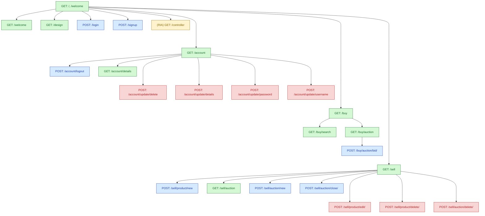

```mermaid
graph TD
    ROOT["GET: /, /welcome"]:::get
    ROOT --> WELCOME["GET: /welcome"]:::get
    ROOT --> DESIGN["GET: /design"]:::get
    ROOT --> LOGIN["POST: /login"]:::post
    ROOT --> SIGNUP["POST: /signup"]:::post
    ROOT --> CONTROLLER["(RIA) GET: /controller"]:::ria-only
    ROOT ----> ACCOUNT["GET: /account"]:::get

    ACCOUNT ---> ACCOUNT_UPDATE_DELETE["POST: /account/update/delete"]:::not-required
    ACCOUNT ---> ACCOUNT_UPDATE_DETAILS["POST: /account/update/details"]:::not-required
    ACCOUNT --> ACCOUNT_LOGOUT["POST: /account/logout"]:::post
    ACCOUNT --> ACCOUNT_DETAILS["GET: /account/details"]:::get
    ACCOUNT ---> ACCOUNT_UPDATE_PASSWORD["POST: /account/update/password"]:::not-required
    ACCOUNT ---> ACCOUNT_UPDATE_USERNAME["POST: /account/update/username"]:::not-required

    ROOT -------> BUY["GET: /buy"]:::get
    BUY --> BUY_SEARCH["GET: /buy/search"]:::get
    BUY --> BUY_AUCTION["GET: /buy/auction"]:::get
    BUY_AUCTION --> BUY_AUCTION_BID["POST: /buy/auction/bid/"]:::post

    ROOT ----------> SELL["GET: /sell"]:::get
    SELL ---> SELL_PRODUCT_EDIT["POST: /sell/product/edit/"]:::not-required
    SELL --> SELL_PRODUCT_NEW["POST: /sell/product/new"]:::post
    SELL ---> SELL_PRODUCT_DELETE["POST: /sell/product/delete/"]:::not-required
    SELL --> SELL_AUCTION_DETAIL["GET: /sell/auction"]:::get
    SELL --> SELL_AUCTION_NEW["POST: /sell/auction/new"]:::post
    SELL ---> SELL_AUCTION_DELETE["POST: /sell/auction/delete/"]:::not-required
    SELL --> SELL_AUCTION_CLOSE["POST: /sell/auction/close/"]:::post

    %% Style definitions
    classDef get fill:#d4f7d4,stroke:#146b27,color:#146b27;
    classDef post fill:#d6eaff,stroke:#1c3cb7,color:#1c3cb7;
    classDef not-required fill:#f9d6d6,stroke:#b71c1c,color:#b71c1c;
    classDef ria-only fill:#fff3cd,stroke:#856404,color:#856404;
```