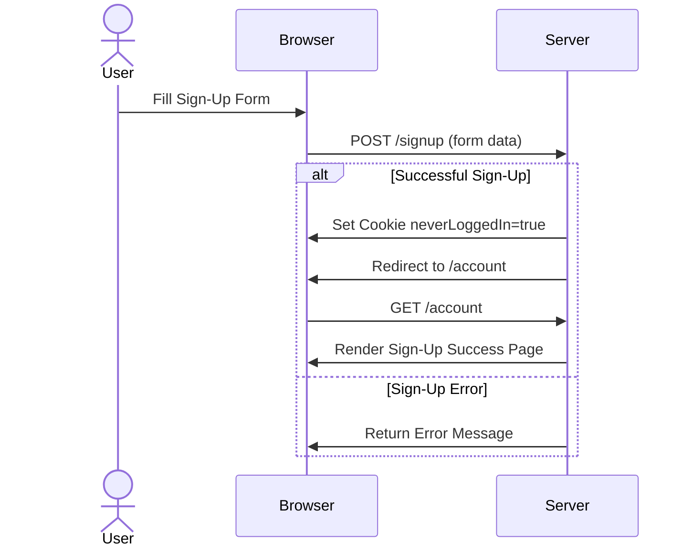
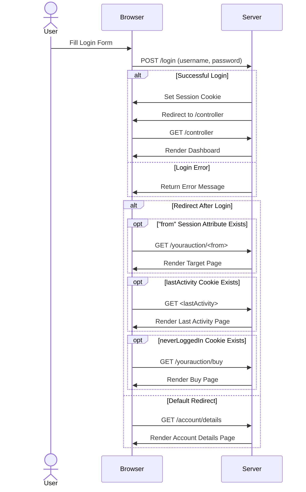

```mermaid
sequenceDiagram
    Actor User
    participant Browser
    participant Server

    User->>Browser: Fill Sign-Up Form
    Browser->>Server: POST /signup (form data)
    alt Successful Sign-Up
        Server->>Browser: Set Cookie neverLoggedIn=true
        Server->>Browser: Redirect to /account
        Browser->>Server: GET /account
        Server->>Browser: Render Sign-Up Success Page
    else Sign-Up Error
        Server->>Browser: Return Error Message
    end
```

```mermaid
sequenceDiagram
    Actor User
    participant Browser
    participant Server

    User->>Browser: Fill Login Form
    Browser->>Server: POST /login (username, password)
    alt Successful Login
        Server->>Browser: Set Session Cookie
        Server->>Browser: Redirect to /controller
        Browser->>Server: GET /controller
        Server->>Browser: Render Dashboard
    else Login Error
        Server->>Browser: Return Error Message
    end

    alt Redirect After Login
        opt "from" Session Attribute Exists
            Browser->>Server: GET /yourauction/<from>
            Server->>Browser: Render Target Page
        end
        opt lastActivity Cookie Exists
            Browser->>Server: GET <lastActivity>
            Server->>Browser: Render Last Activity Page
        end
        opt neverLoggedIn Cookie Exists
            Browser->>Server: GET /yourauction/buy
            Server->>Browser: Render Buy Page
        end
        else Default Redirect
            Browser->>Server: GET /account/details
            Server->>Browser: Render Account Details Page
        end
```