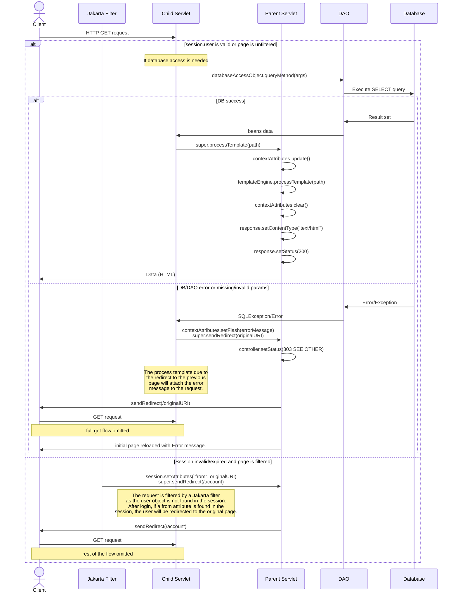
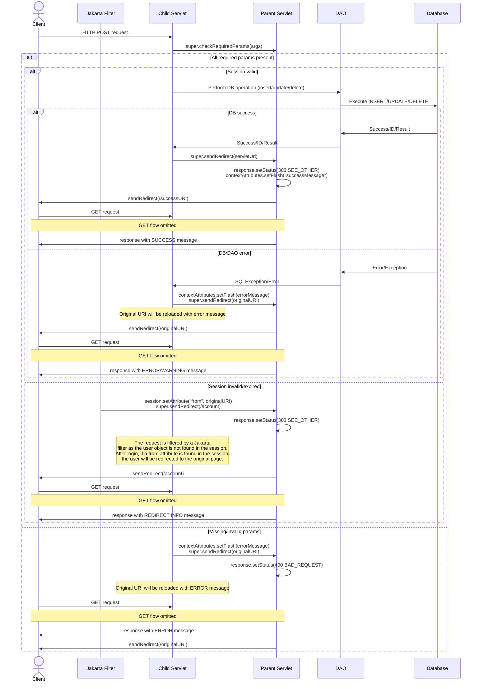
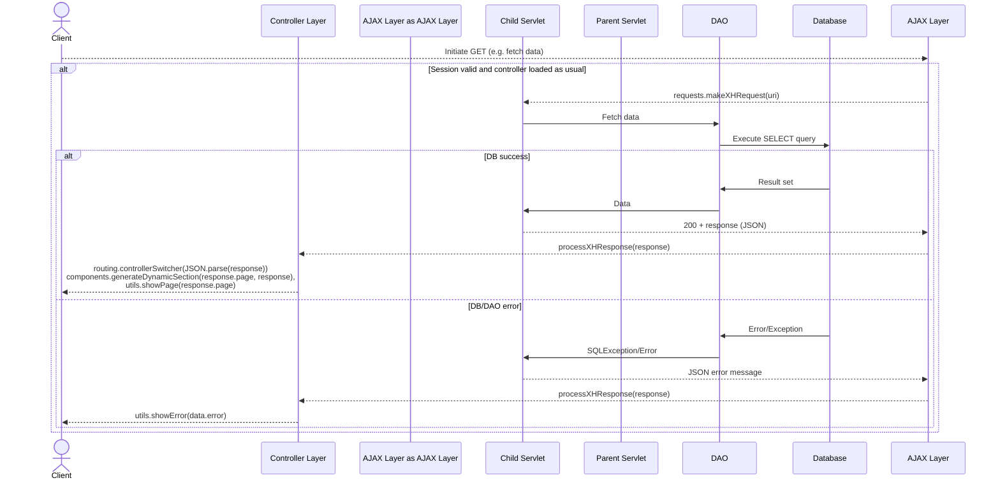
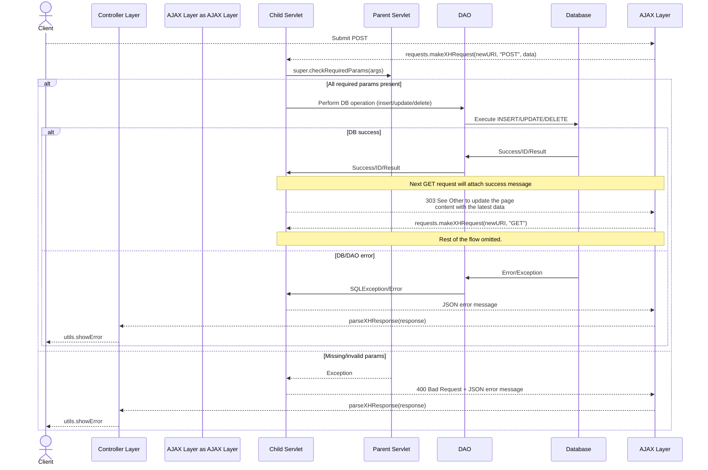

# Sequence Diagrams

## Generic GET Request Sequence Diagram (HTML Pure)

---

## Generic POST Request Sequence Diagram (HTML Pure)

---

## Generic GET Request Sequence Diagram (RIA version)

---

## Generic POST Request Sequence Diagram (RIA version)

